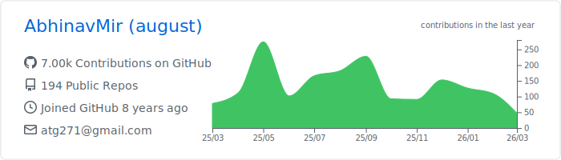
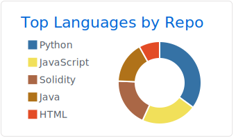
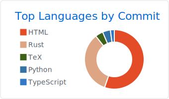
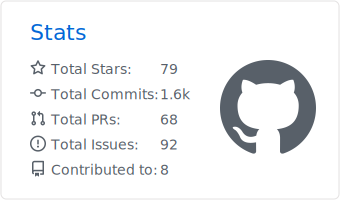

### Hi there 👋
  
- ⛅️ I’m currently working on Blockchain, DLTs, DeFi/Crypto, Distributed Storage.
- 🎈 I have experience with Web Development (Especially with JavaScript, C#, Python and PHP frameworks).
- 📂 I’m currently working at <a href="https://persistence.one">Persistence</a> as a DeFi/Blockchain Research intern and C++ Mentor @ GirlScript's UpLift Project.
- 📁 I was previously at Superbolter, Punar, ACS and Techimax. I was a fellow at Ethereum India.
- 🐧 Project Head @ VIT Linux User Group.
- 📫 How to reach me: abhinavmir@protonmail.com 
- 💾 I write at <a href="http://medium.com/@abhinavmir">Medium</a> and do stuff on <a href="https://www.youtube.com/channel/UCcFGIS9ESqxGytSqU9ELg7w?view_as=subscriber">YouTube</a>.

Note: [Use this to generate profile cards for yourself!](https://github.com/vn7n24fzkq/github-profile-summary-cards)
