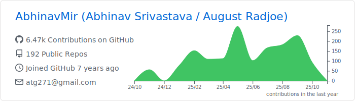
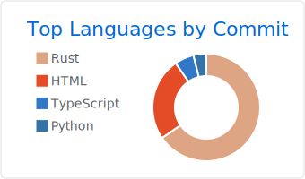

### Hi there 👋
  
- ⛅️ I’m currently working on Blockchain, DLTs, DeFi/Crypto, Distributed Storage.
- 🎈 I have experience with Web Development (Especially with JavaScript, C#, Python and PHP frameworks).
- 📂 I’m currently working at <a href="https://persistence.one">Persistence</a> as a DeFi/Blockchain Research intern.
- 🐧 Project Head @ VIT Linux User Group.
- 📫 How to reach me: abhinavmir@protonmail.com 

[Research](https://www.researchgate.net/profile/Abhinav_Srivastava34) | [Experience](https://abhinavmir.netlify.app/experience/) | [Blogs](medium.com/@abhinavmir)

Note: [Use this to generate profile cards for yourself!](https://github.com/vn7n24fzkq/github-profile-summary-cards)
